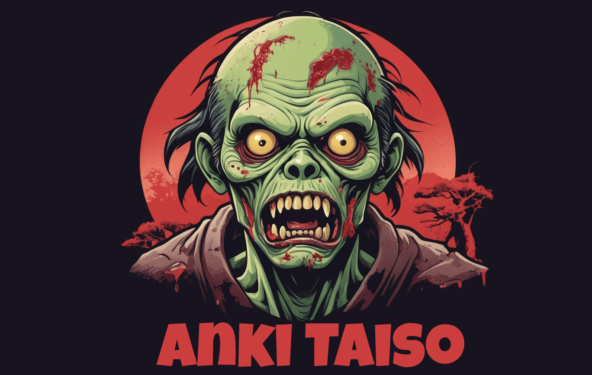

# Anki Taiso

Anki Taiso (暗記体操) - Anki empowered Godot 4 Typing Game

---

[Typing of the Dead](https://en.wikipedia.org/wiki/The_Typing_of_the_Dead) inspired **Typing Game** with support for different alphabets.
Optional integration with [Anki](https://apps.ankiweb.net/) to practise the vocabulary you are learning.

---

## Roadmap

Milestone 1:

- [ ] Basic Typing Game
- [ ] Support Japanese Kanas

Milestone 2:
- [ ] Build/Update Wordlists from Anki Decks
  - with Audio Playback on Success?

Nice to have:
- [ ] Find out why [SceneTree] breaks Export for Win/Mac

---

## Based on

- [WanaKana-net](https://github.com/MartinZikmund/WanaKana-net)
- [Godot 4 Plugins](https://github.com/MakovWait/godot4-plugins)
- Godot Tests: https://github.com/chickensoft-games/GoDotTest
- [GodotSharp SourceGenerators](https://github.com/Cat-Lips/GodotSharp.SourceGenerators)

## Potential Addons:

- https://github.com/Fractural/GDTask
- https://gitlab.com/Xecestel/sound-manager
- https://github.com/98teg/SpriteMesh
- https://github.com/OlliO6/Better-inspector-godot-CSharp
- https://github.com/2shady4u/godot-sqlite
- https://github.com/AnidemDex/Godot-DialogPlugin
- https://github.com/SirLich/gd-explorer
- https://github.com/Dark-Peace/bottled-up-tilemap
- https://github.com/Hugo4IT/Iconify
- https://github.com/Ark2000/PankuConsole
- https://github.com/LauraWebdev/godot_snap_path3d_points_to_floor
- https://github.com/dxdesjardins/GDSave
- https://github.com/Sirush/AnkiDotNet

## Other Links

- https://git.sr.ht/~foosoft/anki-connect

## Other projects

- https://github.com/Maaack/Godot-Game-Template
- https://github.com/Maaack/Godot-Menus-Template
- https://github.com/TinyTakinTeller/TakinGodotTemplate

## Tools used

- [GodotEnv](https://github.com/chickensoft-games/GodotEnv)

## Special thanks to

- [ChickenSoft](https://chickensoft.games/) for their open source contributions!

