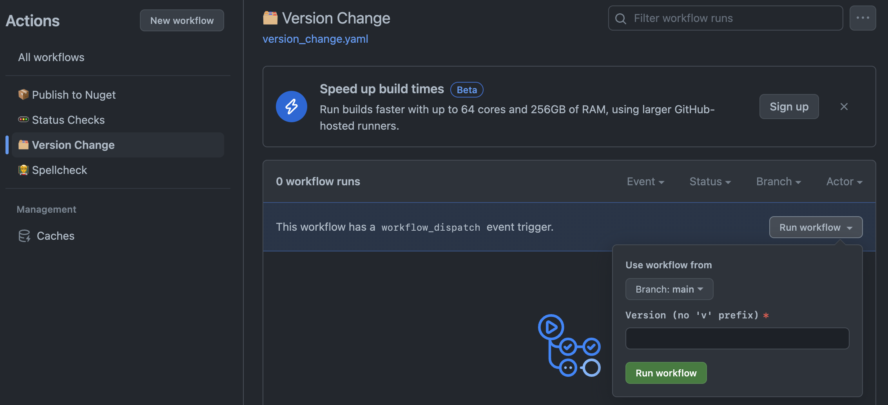

### How to release

The included workflow in [`.github/workflows/release.yaml`](.github/workflows/version_change.yaml) can be manually dispatched to 
- replace the version number in `anki-taiso.csproj` with the version you specify in the workflow's inputs
- create a new commit tagged with the specified version prefixed by v, e.g. v1.2.3
- build a release version for all supported export targets
- upload the builds to a new release with an auto generated changelog

